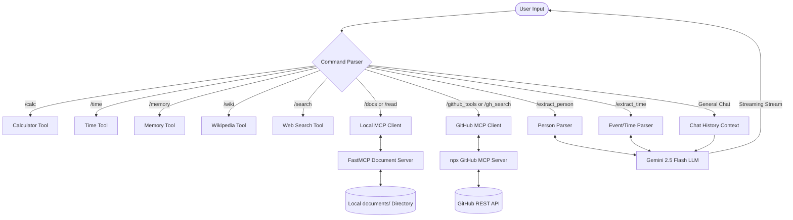

#  Alfred: AI Assistant with Model Context Protocol (MCP) & Extensible Tools

Alfred is a highly customizable AI Assistant built using **LangChain**, **Google Gemini 2.5 Flash**, and the **Model Context Protocol (MCP)**. It serves as both a conversational assistant and a tool-integrated agent capable of searching the web, executing calculations, retrieving Wikipedia articles, querying local documents via a custom MCP server, and searching GitHub repositories using the official GitHub MCP server.

---

##  Key Features

*   ** Streamed Conversational AI**: Utilizes `gemini-2.5-flash` with streaming responses for real-time conversation.
*   ** Built-in Tool Suite**:
    *   **Web Search**: Powered by DuckDuckGo (`ddgs`) to fetch and summarize web search results.
    *   **Wikipedia Integration**: Searches and retrieves summaries of topics directly from Wikipedia.
    *   **Calculator**: Dynamically evaluates math expressions securely.
    *   **Local Time**: Accesses current local date and time.
    *   **Chat Memory**: Tracks and displays conversation logs in-memory.
*   ** Model Context Protocol (MCP) Integration**:
    *   **Local Document Server**: A custom `FastMCP` server (`document_server.py`) exposing tools to list and read documents from a local folder.
    *   **GitHub MCP Client**: Uses `stdio` communication to interface with `@modelcontextprotocol/server-github`, allowing search of GitHub repositories using official GitHub tools.
*   ** Structured Output Extraction**: Employs Pydantic schemas and `PydanticOutputParser` to reliably extract entity information (e.g., Person data, task events with dates/times) from unstructured text.

---

##  System Architecture & Workflow

The following diagram illustrates the flow of control and data inside the AI Assistant:



### Flow Breakdown:
1. **Input Parsing**: Inputs are evaluated in a command-loop in `app.py`.
2. **Command Handling**: If the input starts with a recognized slash-command (e.g., `/search`), it bypasses general LLM generation and directly runs the corresponding tool, parser, or MCP client.
3. **General Chat**: Normal chat prompts pull the last 10 turns from `chat_history`, combine it with the `SYSTEM_PROMPT`, and request a streaming response from the Gemini model.

---

##  Project Structure

```directory
AI-Assistant/
│
├── chatbot/                     # Core Chatbot Application Package
│   ├── mcp/                     # Model Context Protocol modules
│   │   ├── servers/
│   │   │   └── document_server.py # Custom FastMCP Server exposing local files
│   │   ├── client.py            # Local document client routing helper
│   │   └── github_client.py     # Client code interfacing with GitHub MCP via stdio
│   │
│   ├── tools/                   # Built-in modular tools
│   │   ├── calculator_tool.py   # Basic math evaluator
│   │   ├── memory_tool.py       # Conversational memory exporter
│   │   ├── search_tool.py       # DuckDuckGo search integration + LLM summarizer
│   │   ├── time_tool.py         # Local clock utility
│   │   └── wiki_tool.py         # Wikipedia lookup agent
│   │
│   ├── chatbot.py               # Conversational logic, entity & event extraction
│   ├── config.py                # Environment configuration loader
│   ├── llm.py                   # Gemini 2.5 Flash LLM instantiation
│   ├── memory.py                # In-memory history buffer
│   ├── output_parser.py         # Pydantic schemas (Person, Event) & Output Parsers
│   └── prompt.py                # System instruction templates
│
├── database/                    # Database storage (presently empty/reserved)
├── documents/                   # Target files directory for the Document Server
│   ├── langchain.txt
│   └── mcp.txt
│
├── ui/
│   └── streamlit_ui.py          # Placeholder for Streamlit web interface
│
├── uploads/                     # Placeholder for file upload storage
├── tests/                       # Unit tests directory
│
├── .env                         # API Keys and Environment Variables
├── .gitignore                   # Git exclusion rules
├── app.py                       # Main CLI Entrypoint
├── requirements.txt             # Python dependencies
└── test_wiki.py                 # Quick verification script for wikipedia tool
```

---

## 🛠️ Installation & Setup

### Prerequisites
* Python 3.10 or higher
* Node.js and `npm` (required only for the GitHub MCP server)
* A valid Google Gemini API Key
* A GitHub Personal Access Token (PAT)

### Setup Steps
1. **Clone the Repository**
   ```bash
   git clone https://github.com/alfredjosepht/AI-Assistant.git
   cd AI-Assistant
   ```

2. **Set up Virtual Environment**
   ```bash
   python -m venv venv
   # On Windows:
   .\venv\Scripts\activate
   # On macOS/Linux:
   source venv/bin/activate
   ```

3. **Install Dependencies**
   ```bash
   pip install -r requirements.txt
   ```
   *Note: Ensure packages like `wikipedia` and `duckduckgo-search` (or `ddgs`) are installed if not already configured in your system environment.*

4. **Environment Configuration**
   Create a `.env` file in the root directory (or edit the existing one) with the following structure:
   ```env
   GOOGLE_API_KEY=your_gemini_api_key_here
   GITHUB_TOKEN=your_github_personal_access_token_here
   ```

---

##  How to Run and Use

### Starting the CLI Assistant
To launch the interactive CLI prompt, run:
```bash
python app.py
```

Inside the interface, you can converse with the assistant normally, or type `/` commands.

### Supported Commands

| Command | Action / Tool Run | Description |
| :--- | :--- | :--- |
| `exit` | Quit | Terminate the application session |
| `/extract_person` | Entity Extraction | Prompts for a sentence and returns structured person info (Name, Age) |
| `/extract_time` | Entity Extraction | Prompts for a sentence and extracts Task and DateTime fields |
| `/calc` | Calculator | Prompts for an algebraic expression and returns evaluated math results |
| `/time` | Local Time | Displays current date and time |
| `/memory` | Memory | Prints the current session's chat history buffer |
| `/wiki` | Wikipedia Search | Prompts for search terms and displays a 3-sentence Wikipedia summary |
| `/search` | Web Search | Conducts a DuckDuckGo query and streams a summarized LLM answer |
| `/docs` | Local MCP Files | Queries the local `DocumentServer` to list available file names |
| `/read` | Local MCP File Read | Reads and displays the file content from `documents/` via the local server |
| `/github_tools` | GitHub MCP | Lists the tool names registered by the stdio GitHub MCP server |
| `/gh_search` | GitHub Search | Queries repositories matching the term using `@modelcontextprotocol/server-github` |

### Running the Custom MCP Document Server
To host the FastMCP server standalone:
```bash
mcp dev chatbot/mcp/servers/document_server.py
# OR
python chatbot/mcp/servers/document_server.py
```

---

##  Contributing
Feel free to open issues or submit pull requests to extend the toolsets or refine the Streamlit GUI.
